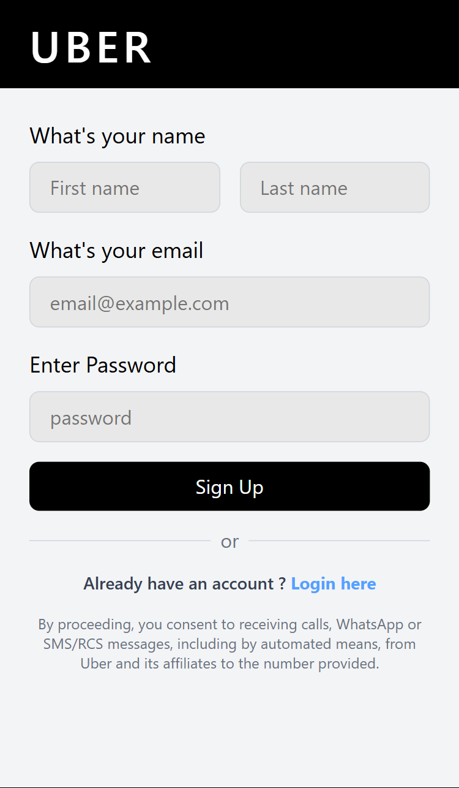
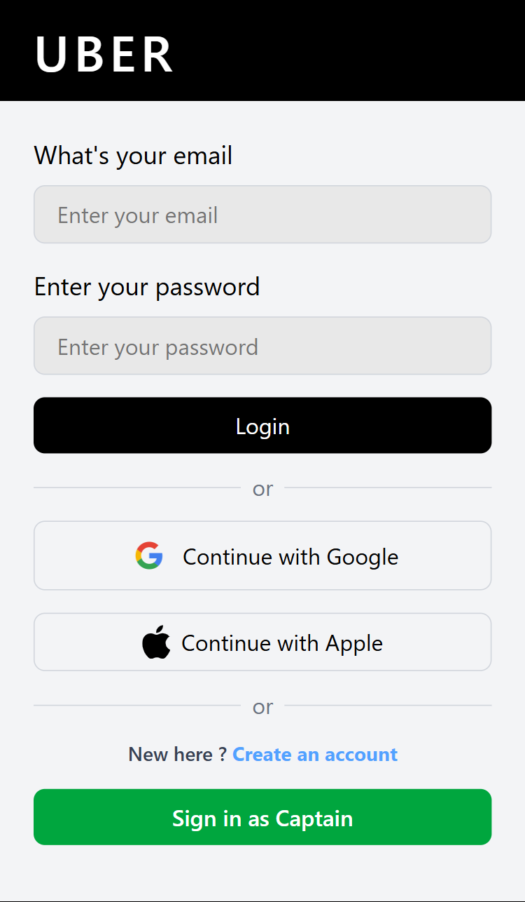
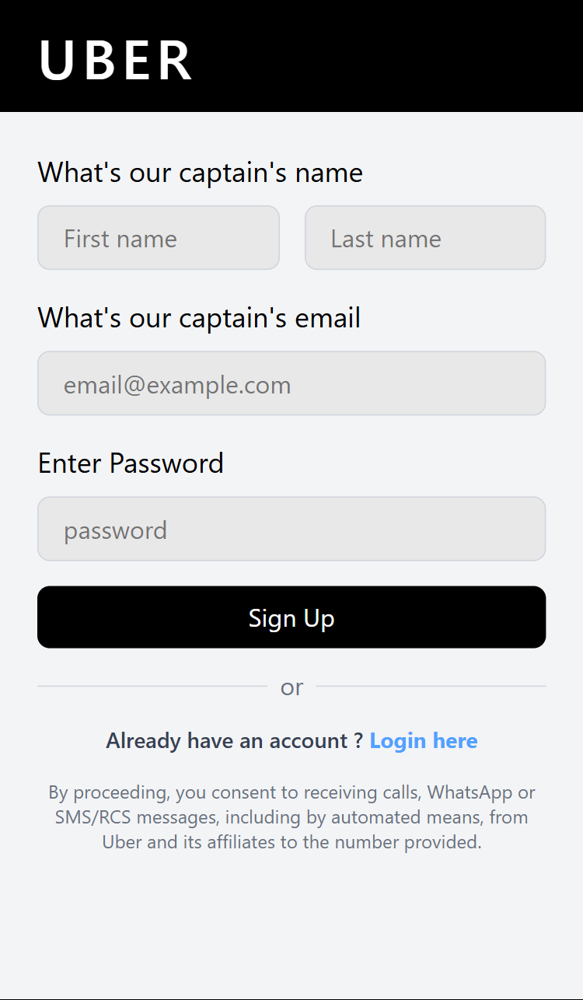
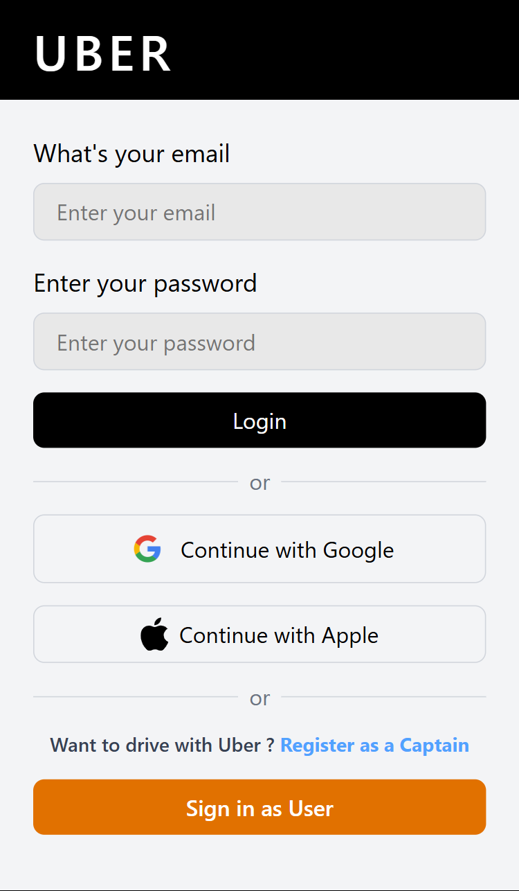

# Uber Application Frontend

This is the frontend for the Uber Application, built using **React**, **Tailwind CSS**, and **React Router**. The application includes the following pages:

- **Home Page**
- **User Sign Up**
- **User Login**
- **Captain Sign Up**
- **Captain Login**

---

## Features

- **Responsive Design**: The application is fully responsive and works seamlessly on all devices.
- **User and Captain Authentication**: Separate login and sign-up pages for users and captains.
- **Modern UI**: Built with Tailwind CSS for a clean and modern design.
- **Routing**: Implemented using React Router for seamless navigation.

---

## Technologies Used

- **React**: For building the user interface.
- **Tailwind CSS**: For styling the application.
- **React Router**: For navigation between pages.

---

## Pages Overview

### 1. Home Page

The home page serves as the landing page for the application. It includes a background image and a "Continue" button to navigate to the login page.


---

### 2. User Sign Up

The user sign-up page allows users to create an account by entering their first name, last name, email, and password.



---

### 3. User Login

The user login page allows users to log in using their email and password. It also includes options to log in with Google or Apple.



---

### 4. Captain Sign Up

The captain sign-up page allows captains to register by entering their first name, last name, email, and password.



---

### 5. Captain Login

The captain login page allows captains to log in using their email and password. It also includes options to log in with Google or Apple.



---

## How to Run the Application

Follow these steps to set up and run the frontend of the Uber Application:

### 1. Clone the Repository

Clone the repository to your local machine using the following command:

```bash
git clone <[repository-url](https://github.com/Trilokrana/Uber-Application.git)>
```

Navigate to the Frontend Directory
Change your working directory to the Frontend folder:

```bash
cd Frontend
```

Install Dependencies
Install all the required dependencies using npm:
```
npm install
```

Start the Development Server
Run the following command to start the development server:

```
npm run dev
```

Open the Application in Your Browser
Once the development server is running, open your browser and navigate to:
```
http://localhost:3000
```
